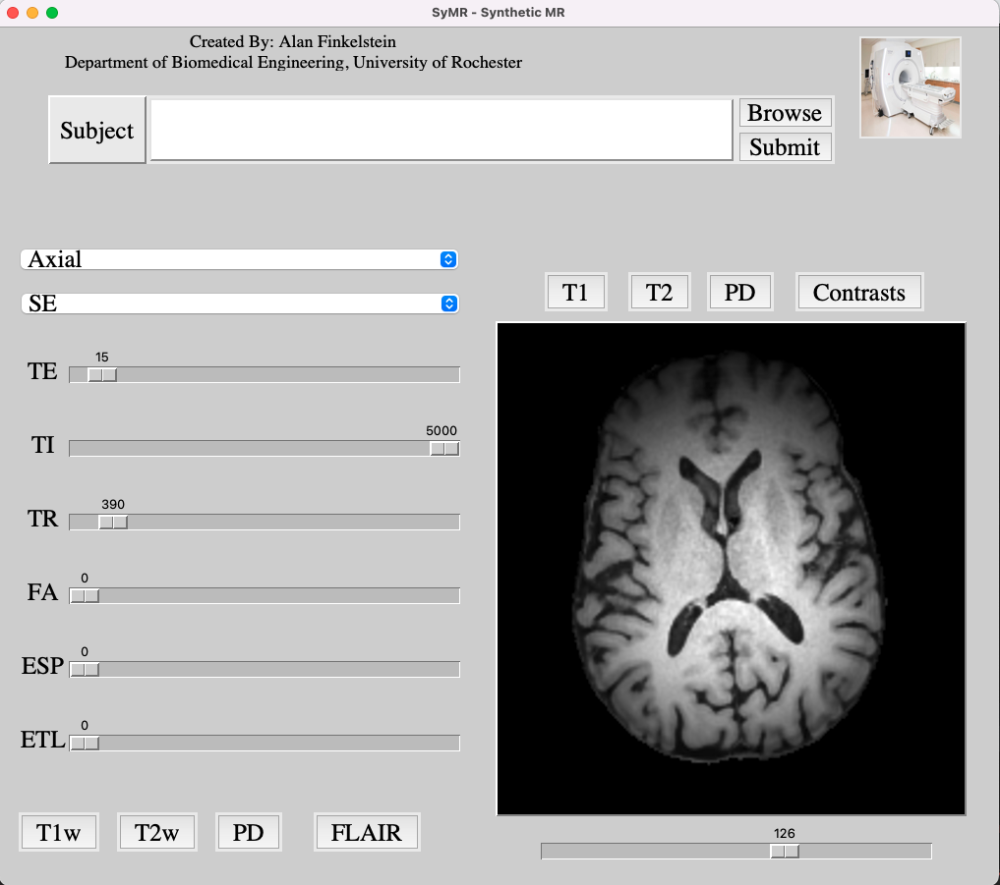

#  SyMR: A Graphical User Interface for Synthetic MRI  

A GUI for generating and viewing synthetic mri images. 

## Installation 

To download use `git clone https://github.com/afinkelstein65/SyMR.git` or download zip file. 

## Usage 

To run simply double click the SyMR application, or you may run from the terminal using `python main.py`. 

## Notes

At this time only SE and FSE sequences are configured for simulations. Simulations require T1, T2 and PD maps. 
We plan to eventually include functionality for ADC, IVIM, and DKI maps for improved signal modeling. In addition we intend to expand our signal models using the extended phase graph formalism for GRE sequences.

## References: 

1. The shortcut was made using [pyshortcuts](https://github.com/newville/pyshortcuts)
